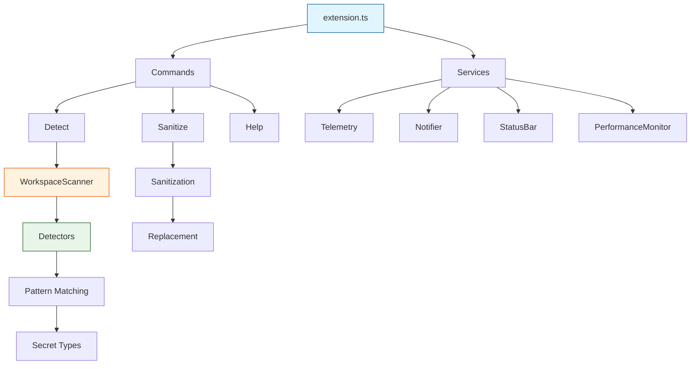
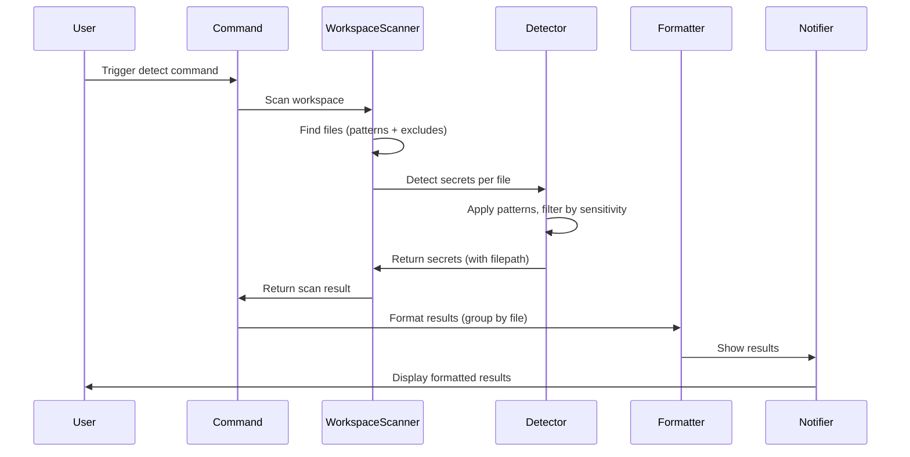

# Secrets-LE Architecture

## Design Principles

**Functional First**: Pure functions with explicit return types, `readonly` types throughout, `Object.freeze()` for immutability, factory functions over classes.

**Developer Empathy**: Unobtrusive defaults, subtle status bar feedback, graceful error degradation, performance-aware with large file warnings, local-only processing.

**Immutability**: All exports frozen, readonly interfaces, immutable configuration, safe error handling without side effects.

**Security-First**: Local-only processing, no external network requests, workspace-wide scanning with smart exclusions.

## System Architecture



## Component Responsibilities

### 1. Extension Entry (`src/extension.ts`)

Minimal activation with dependency injection:

```typescript
export function activate(context: vscode.ExtensionContext): void {
  const services = createServices(context);

  registerCommands(context, {
    telemetry: services.telemetry,
    notifier: services.notifier,
    statusBar: services.statusBar,
    performanceMonitor: services.performanceMonitor,
  });

  registerOpenSettingsCommand(context, services.telemetry);
  services.telemetry.event('extension-activated');
}
```

**Role**: Service instantiation, command registration, disposable management.

### 2. Command System (`src/commands/`)

Factory pattern with workspace scanning:

```typescript
export function registerDetectCommand(
  context: vscode.ExtensionContext,
  deps: Readonly<CommandDependencies>,
): void {
  const disposable = vscode.commands.registerCommand(
    'secrets-le.detect',
    async () => {
      await deps.notifier.showProgress(
        'Scanning workspace for secrets...',
        async (progress, token) => {
          const scanResult = await scanWorkspaceForSecrets({
            patterns: config.workspaceScanPatterns,
            excludes: config.workspaceScanExcludes,
            // ...
          });
          // Process results
        },
      );
    },
  );

  context.subscriptions.push(disposable);
}
```

**Commands**: `detect`, `sanitize`, `help`, `openSettings`

### 3. Configuration (`src/config/`)

Type-safe, frozen configuration:

```typescript
export function getConfiguration(): Configuration {
  const config = vscode.workspace.getConfiguration('secrets-le');

  return Object.freeze({
    detectionSensitivity: readSensitivity(config),
    detectionIncludeApiKeys: Boolean(config.get('detection.includeApiKeys', true)),
    workspaceScanPatterns: Object.freeze(config.get('workspace.scanPatterns', ['**/*'])),
    workspaceScanExcludes: Object.freeze(config.get('workspace.scanExcludes', [...])),
    // ...
  });
}
```

**Features**: Immutable objects, real-time updates, default values, type safety.

### 4. Workspace Scanner (`src/utils/workspaceScanner.ts`)

Scans entire workspace for secrets:

```typescript
export async function scanWorkspaceForSecrets(
  options: WorkspaceScanOptions = {},
): Promise<WorkspaceScanResult> {
  // Find files matching patterns
  const allFiles = await vscode.workspace.findFiles(...);
  
  // Process each file
  for (const fileUri of allFiles) {
    const content = document.getText();
    const secrets = detectSecretsInContent(content, options);
    // Tag secrets with filepath
  }
  
  return Object.freeze({
    secrets: Object.freeze(secrets),
    filesScanned: count,
    // ...
  });
}
```

**Features**: Parallel file discovery, smart exclusions, file size limits, binary detection, cancellation support.

### 5. Detection Engine (`src/extraction/`)

Pattern-based secret detection:

```typescript
export function detectSecrets(
  content: string,
  options: DetectionOptions,
): readonly DetectedSecret[] {
  const secrets: DetectedSecret[] = [];
  
  for (const pattern of SECRET_PATTERNS) {
    const matches = Array.from(content.matchAll(pattern.pattern));
    for (const match of matches) {
      const confidence = pattern.confidence(match, line);
      if (matchesSensitivity(confidence, options.sensitivity)) {
        secrets.push(buildSecret(match, pattern, lineNum));
      }
    }
  }
  
  return Object.freeze(secrets);
}
```

**Secret Types**: API keys, AWS keys, Azure keys, GCP keys, passwords, tokens, JWT, OAuth, private keys, SSH keys, PGP keys, database URLs, session IDs, cookies.

**Process**: Pattern matching → Confidence calculation → Sensitivity filtering → Deduplication → Result freezing

### 6. Sanitization Engine (`src/extraction/extract.ts`)

Replaces secrets with safe placeholders:

```typescript
export function sanitizeContent(
  content: string,
  secrets: readonly DetectedSecret[],
  replaceWith: string = '***REDACTED***',
): SanitizationResult {
  let sanitized = content;
  const sortedSecrets = [...secrets].sort((a, b) => {
    // Sort from end to start to preserve positions
  });

  for (const secret of sortedSecrets) {
    // Replace at exact position
    sanitized = replaceAtPosition(sanitized, secret, replaceWith);
  }

  return Object.freeze({
    success: true,
    sanitizedContent: sanitized,
    replacements: Object.freeze(replacements),
    // ...
  });
}
```

**Features**: Position-aware replacement, multiple secret handling, metadata tracking.

## Data Flow

### Workspace Detection Pipeline



### Error Handling Flow

1. Error occurs during processing
2. Categorize by type (parse, file-system, validation, safety)
3. Determine severity (info, warning, error, critical)
4. Select recovery action (retry, skip, abort)
5. Notify user with context
6. Log to telemetry (local only)

## Service Dependencies

### Dependency Injection Pattern

```typescript
interface CommandDependencies {
  readonly telemetry: Telemetry
  readonly notifier: Notifier
  readonly statusBar: StatusBar
  readonly performanceMonitor: PerformanceMonitor
}

export function registerCommands(
  context: vscode.ExtensionContext,
  deps: Readonly<CommandDependencies>,
): void {
  registerDetectCommand(context, deps)
  registerSanitizeCommand(context, deps)
}
```

**Why**: Testing with mocks, clear dependency graph, loose coupling, composition over inheritance.

## File Organization

```
src/
├── extension.ts          # Activation entry point
├── types.ts              # Centralized type definitions
├── commands/             # Command implementations
│   ├── detect.ts         # Workspace secret detection
│   ├── sanitize.ts       # Secret sanitization
│   ├── help.ts           # Help command
│   └── index.ts          # Command registration
├── config/               # Configuration management
│   ├── config.ts         # Configuration reading
│   └── settings.ts       # Settings command
├── extraction/           # Secret detection logic
│   ├── detectors.ts      # Pattern definitions
│   ├── extract.ts        # Detection & sanitization
│   └── formats/          # Format-specific (future)
├── utils/                # Utility services
│   ├── workspaceScanner.ts  # Workspace file scanning
│   ├── errorHandling.ts  # Error handling
│   ├── performance.ts    # Performance monitoring
│   ├── safety.ts         # Safety checks
│   └── localization.ts    # I18N utilities
├── ui/                   # User interface
│   ├── notifier.ts       # Notifications
│   ├── statusBar.ts      # Status bar
│   └── output.ts         # Output channel
├── services/             # Service factory
│   └── serviceFactory.ts # Service initialization
└── telemetry/            # Local telemetry
    └── telemetry.ts
```

## Performance Strategy

**Memory**: File-by-file processing, streaming for large workspaces, efficient data structures, configurable thresholds

**CPU**: Efficient regex matching, early termination, cancellation support, parallel file discovery

**I/O**: Chunked reading, progress indication, safety checks, smart exclusions

## Security & Privacy

**Local-Only**: No external network requests, no data collection, local telemetry only, VS Code workspace trust compliance

**Input Validation**: Safe pattern matching, sanitized input, resource limits, file size checks

**Smart Exclusions**: Automatically skips node_modules, .git, build artifacts, binary files

## Testing Approach

**Coverage Target**: Maintain reasonable coverage across core functionality

**Test Types**: Unit (pure functions), integration (workspace scanning), security (pattern matching), error handling (edge cases)

**Framework**: Vitest with V8 coverage provider

## Design Rationale

### Why Workspace Scanning Instead of Single File?

- **Security Audits**: Secrets can be anywhere in the codebase
- **Compliance**: Need to scan entire projects, not just active files
- **Efficiency**: One command scans everything vs opening each file
- **GitGuardian-like**: Matches industry-standard secret scanning tools

### Why Pattern-Based Detection?

- **Universal**: Works on any text file without format parsing
- **Fast**: Regex matching is highly optimized
- **Flexible**: Easy to add new secret patterns
- **Maintainable**: Clear pattern definitions

### Why Smart Exclusions?

- **Performance**: Skip large directories automatically
- **Noise Reduction**: Focus on source code, not dependencies
- **User Experience**: Faster scans without manual configuration

---

**Related:** [Commands](COMMANDS.md) | [Testing](TESTING.md) | [Performance](PERFORMANCE.md)

